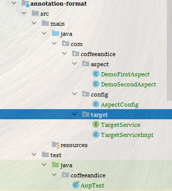

# AOP-annotation方式

<nav>
<a href="#"></a><br/>
<a href="#目录结构">1、目录结构</a><br/>
<a href="#切面示例">2、切面示例</a><br/>
<a href="#免配置">3、免配置</a><br/>
&nbsp;&nbsp;&nbsp;&nbsp;&nbsp;&nbsp;&nbsp;&nbsp;<a href="#免配置文件">免配置文件</a><br/>
&nbsp;&nbsp;&nbsp;&nbsp;&nbsp;&nbsp;&nbsp;&nbsp;<a href="#官方配置文档">官方配置文档</a><br/>
<a href="#方法测试">4、方法测试</a><br/>
&nbsp;&nbsp;&nbsp;&nbsp;&nbsp;&nbsp;&nbsp;&nbsp;<a href="#测试结果">测试结果</a><br/>
</nav>


## 目录结构

> 为当前模块简单的结构




## 切面示例

> 基础依旧主要常用的五个切面示例的方法
> 但是我们这里引入了注解


## 免配置

### 免配置文件

> 基于5.1.7 约束文档下的自定义aop配置文件 AspectConfig.java
>
> 额外配置扫描包扫描路径下的注解


###  官方配置文档

`https://docs.spring.io/spring/docs/5.1.7.RELEASE/spring-framework-reference/core.html#aop-enable-aspectj-java`


## 方法测试

> ​	这里主要涉及两个方法
>
> **testAdvice**：测试主体切面方法
>
> **testExceptAdvice**：就是让你看看异常那个方法，以及始终会执行的后置通知 `after`

```java
...
public void test() {
    targetService.testAdvice("fuck");
    targetService.testExceptAdvice("except ready");

}
...
```

### 测试结果

> 整个流程类似于一个先进后出的一个逻辑，层层包裹

```
第一个环绕通知-前
第一个前置调用方法
第二个环绕通知-前
第二个前置调用方法
方法进来了,参数是:fuck
第二个环绕通知-后
第二个后置通知
第二个后置返回通知结果null
第一个环绕通知-后
第一个后置通知
第一个后置返回通知结果null
第一个环绕通知-前
第一个前置调用方法
第二个环绕通知-前
第二个前置调用方法
方法进来了,即将异常，参数是:except ready
第二个后置通知
第二个在异常之后通知:java.lang.ArithmeticException: / by zero
第一个后置通知
第一个在异常之后通知:java.lang.ArithmeticException: / by zero

java.lang.ArithmeticException: / by zero
```

