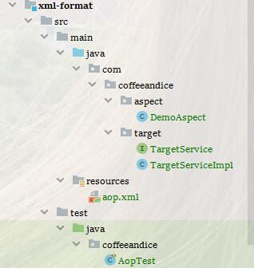
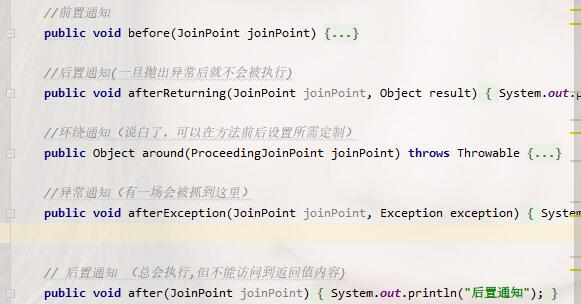

# AOP-xml方式

<nav>
<a href="#"></a><br/>
<a href="#目录结构">1、目录结构</a><br/>
<a href="#切面示例">2、切面示例</a><br/>
<a href="#xml配置">3、xml配置</a><br/>
&nbsp;&nbsp;&nbsp;&nbsp;&nbsp;&nbsp;&nbsp;&nbsp;<a href="#当前目录约束文档">当前目录约束文档</a><br/>
&nbsp;&nbsp;&nbsp;&nbsp;&nbsp;&nbsp;&nbsp;&nbsp;<a href="#官方约束文档">官方约束文档</a><br/>
<a href="#方法测试">4、方法测试</a><br/>
&nbsp;&nbsp;&nbsp;&nbsp;&nbsp;&nbsp;&nbsp;&nbsp;<a href="#测试结果">测试结果</a><br/>
</nav>


## 目录结构

> 为当前模块简单的结构




## 切面示例

> 基础主要常用的五个切面示例的方法




## xml配置

### 当前目录约束文档

> 基于5.1.7 约束文档下的自定义aop配置文件

```xml
<?xml version="1.0" encoding="UTF-8"?>
<beans xmlns="http://www.springframework.org/schema/beans"
       xmlns:xsi="http://www.w3.org/2001/XMLSchema-instance"
       xmlns:aop="http://www.springframework.org/schema/aop" xsi:schemaLocation="
        http://www.springframework.org/schema/beans https://www.springframework.org/schema/beans/spring-beans.xsd
        http://www.springframework.org/schema/aop https://www.springframework.org/schema/aop/spring-aop.xsd">

    <!-- bean definitions here -->
    <!-- 1.配置目标对象 -->
    <bean name="targetService" class="com.coffeeandice.target.TargetServiceImpl"/>
    <!-- 2.声明切面 -->
    <bean name="myAdvice" class="com.coffeeandice.aspect.DemoAspect"/>
    <!-- 3.配置将通知织入目标对象 -->
    <aop:config>
        <!--命名切入点 关于切入点更多表达式写法可以参见README.md-->
        <aop:pointcut expression="execution(* com.coffeeandice.target.TargetService.*(..))" id="cutPoint"/>
        <aop:aspect ref="myAdvice">
            <!-- 前置通知 -->
            <aop:before method="before" pointcut-ref="cutPoint"/>
            <!-- 后置通知 如果需要拿到返回值 则要指明返回值对应的参数名称-->
            <aop:after-returning method="afterReturning" pointcut-ref="cutPoint" returning="result"/>
            <!-- 环绕通知 -->
            <aop:around method="around" pointcut-ref="cutPoint"/>
            <!-- 后置异常 如果需要拿到异常 则要指明异常对应的参数名称 -->
            <aop:after-throwing method="afterException" pointcut-ref="cutPoint" throwing="exception"/>
            <!-- 最终通知 -->
            <aop:after method="after" pointcut-ref="cutPoint"/>
        </aop:aspect>
    </aop:config>
</beans>
```

###  官方约束文档

`https://docs.spring.io/spring/docs/5.1.7.RELEASE/spring-framework-reference/core.html#xsd-schemas-aop`


## 方法测试

> ​	这里主要涉及两个方法
>
> **testAdvice**：测试主体切面方法
>
> **testExceptAdvice**：就是让你看看异常那个方法，以及始终会执行的后置通知 `after`

```java
...
public void test() {
    targetService.testAdvice("fuck");
    targetService.testExceptAdvice("except ready");

}
...
```

### 测试结果

```
前置调用方法
目标方法名为:testAdvice
目标方法所属类的简单类名:TargetService
目标方法所属类的类名:com.coffeeandice.target.TargetService
目标方法声明类型:public abstract
第1个参数为:fuck
被代理的对象:com.coffeeandice.target.TargetServiceImpl@5c86a017
代理对象自己:com.coffeeandice.target.TargetServiceImpl@5c86a017
环绕通知-前
方法进来了,参数是:fuck
后置通知
环绕通知-后
后置返回通知结果null

前置调用方法
目标方法名为:testExceptAdvice
目标方法所属类的简单类名:TargetService
目标方法所属类的类名:com.coffeeandice.target.TargetService
目标方法声明类型:public abstract
第1个参数为:except ready
被代理的对象:com.coffeeandice.target.TargetServiceImpl@5c86a017
代理对象自己:com.coffeeandice.target.TargetServiceImpl@5c86a017
环绕通知-前
方法进来了,即将异常，参数是:except ready
后置通知
在异常之后通知:java.lang.ArithmeticException: / by zero
```

